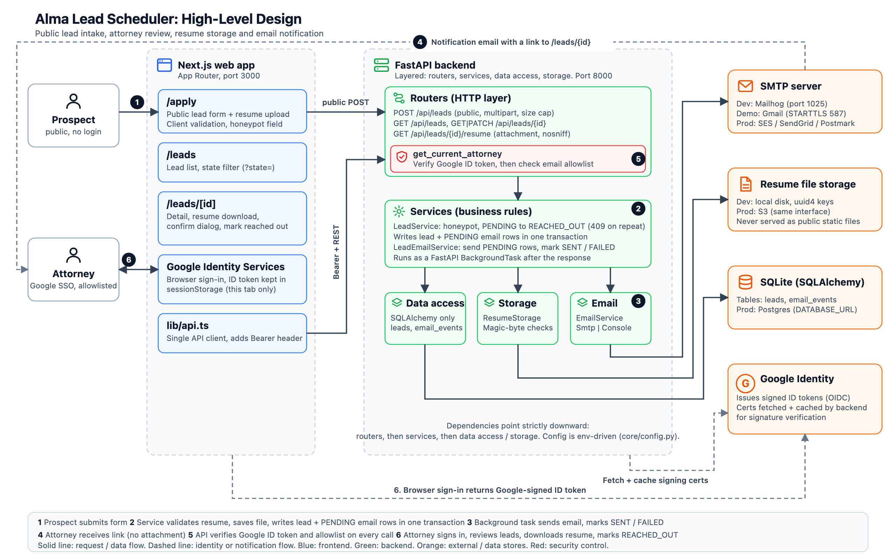

# System Design

This is the short version of [Decisions.MD](Decisions.MD), which holds the full reasoning and the rejected alternatives for every choice below.

## What it does

A prospect submits their details and resume on a public form. Attorneys sign in, review the leads, and mark each one as reached out. Each submission emails the attorneys a link to the lead. The stack is FastAPI, SQLAlchemy and SQLite on the backend and Next.js (App Router) on the frontend.

## High-level design

Vector version: [architecture-hld.svg](architecture-hld.svg).

| Step | What happens |
| --- | --- |
| 1 | The prospect submits one multipart `POST /api/leads` from `/apply`. |
| 2 | `LeadService` checks the honeypot, `ResumeStorage` validates and saves the file, and the lead plus one `PENDING` email row per attorney are written in a single transaction. |
| 3 | A background task sends each pending email and marks it `SENT` or `FAILED`. |
| 4 | Attorneys get an email with a link to `/leads/{id}`, never the resume itself. |
| 5 | Every attorney API call carries a Google ID token. The API verifies it and checks the email against the allowlist. |
| 6 | Attorneys sign in with Google, review leads, download resumes and mark leads `REACHED_OUT`. |

## Key decisions

**Architecture**
- **Strict layering:** `routers -> services -> data_acceses / storage -> models`. Business rules are testable without HTTP or a database, and swapping the database or email provider stays a local change.
- **Config is env-driven** and read in one place. No secrets in code.

**Auth**
- **Google SSO, verified by the API.** We delegate passwords and MFA to Google. The frontend uses Google's browser sign-in and sends the ID token as a Bearer header, so there is no client secret, callback route or session layer. Tokens last about an hour, so attorneys sign in again after that.
- **A separate attorney allowlist** decides access. A valid Google login alone gets a 403.
- **Identity never comes from the request body.** Schemas forbid extra fields, and `reached_out_by` is derived from the verified token.

**Data**
- **SQLite via SQLAlchemy**, with the path in `DATABASE_URL`. Postgres is the production upgrade. Tables come from `create_all` for now, and Alembic is due before the next schema change.
- **Lead ids are UUIDs**, so they are not guessable in URLs.
- **Duplicate submissions are allowed.** A unique email would block legitimate resubmissions and leak which emails already exist. The list shows newest first.
- **Lead lifecycle** is `PENDING -> REACHED_OUT` only, set by an attorney. It is enforced in the service, and a repeat returns 409 so the original who and when survive. The UI asks for confirmation first because there is no undo.

**Resumes**
- **Files live outside the database** behind a `ResumeStorage` interface: local disk now, S3 in production.
- **Uploads are validated by content, not by filename or `Content-Type`.** PDF, DOC and DOCX are accepted, capped by `RESUME_MAX_BYTES`, and stored under generated `<uuid>.<ext>` keys, which rules out path traversal.
- **Downloads go through an authenticated endpoint only.** They are sent as attachments with `nosniff` and `no-store`, under the original filename after sanitising.

**Email**
- **`email_events` is a core table.** Its `PENDING` rows are written in the same transaction as the lead, so a crash can never lose a notification. `SENT` means the provider accepted the message, not that it was delivered.
- **Emails are sent by a FastAPI background task**, so a slow mail server never slows or fails a submission. Failures are recorded as `FAILED` and never raised.
- **Emails carry a link, not the resume.** The resume stays behind login and out of inboxes.
- **`EmailService` is an interface** over plain SMTP settings. Mailhog is used in dev, Gmail for a real-delivery demo, and a transactional provider (SES, SendGrid, Postmark) in production. Moving between them is a config change.

**API and abuse handling**
- **`POST /api/leads` is public and multipart.** The lead and resume arrive together, so there are no orphaned uploads. `PATCH /api/leads/{id}` accepts only `state`.
- **The honeypot returns a fake 201**, so bots get no signal. Nothing is stored or emailed.
- **Domain errors map to HTTP codes in one place:** 401, 403, 404, 409, 413, 415 and 422.

## Tradeoffs

Each row is a choice where we accepted a cost on purpose.

| Choice | What we gain | What it costs |
| --- | --- | --- |
| SQLite | No server, trivial setup and tests, matches the required stack | One writer at a time, no row locking for email retries, `create_all` cannot alter existing tables |
| Google ID token in `sessionStorage`, no refresh | No client secret, callback route or session layer to build and secure | Attorneys sign in again after about an hour, and the server cannot fetch attorney data itself, so pages load data in client components |
| `BackgroundTasks` for email | No extra infrastructure, and a slow mail server cannot fail a submission | Tasks are lost if the process dies, and `FAILED` rows are not retried yet |
| Email carries a link, not the resume | Resume stays behind login and out of inboxes | Attorneys must sign in before they can open the resume |
| No unique constraint on email | Prospects can correct or resubmit, and the form does not reveal who already applied | Attorneys may see duplicate leads |
| Two-state lifecycle with no undo | Minimal rules, and the original who and when are preserved | A wrong click cannot be reversed, so the UI adds a confirmation dialog |
| Honeypot and size cap instead of CAPTCHA and rate limiting | No third-party dependency before there is traffic to protect | A determined bot or a flood of submissions is not stopped |
| Format check on resumes (magic bytes) | Cheap, bounded in memory, cannot be spoofed by filename or header | Confirms the format only, not that the file is safe |
| Gmail SMTP for the demo | Real delivery today with no domain to verify | About 500 messages a day, no domain authentication, may land in spam |

### Implementation tradeoffs made during the build

Smaller choices made while writing the code, each with the cost we accepted.

| Choice | What we gain | What it costs |
| --- | --- | --- |
| `state` stored as a string, not a native DB enum | Works the same on SQLite and Postgres, and Alembic handles it cleanly | The database itself does not reject an invalid state; the service and schema do |
| Data access flushes on `add` and exposes `commit()` | The lead and its `email_events` rows save in one transaction | Callers must remember to commit |
| Only requested fields stored, no `updated_at` | Smaller schema, nothing speculative | Adding a field later means a schema change |
| Resume filename stored as text, only to name the download | Attorneys get the file under the name the prospect gave it | One more column, and the name is untrusted, so it is sanitised and the extension forced from the file type |
| One `email_events` row per attorney | One bad address cannot hide a delivered email | More rows, and the attorney allowlist doubles as the notification list |
| Console fallback when `SMTP_HOST` is empty | The app runs with no mail server or secrets | Emails are not really sent unless SMTP is configured, so a misconfiguration can go unnoticed |
| Sync endpoints, read capped at `RESUME_MAX_BYTES + 1` | Blocking DB and disk work runs in the threadpool, and memory is bounded | The server still receives the whole upload first; a proxy limit is needed |
| DOC and DOCX detected by Word-specific markers, not just headers | Spreadsheets, slides and archives are rejected | More validation code, and a crafted file with the right markers still passes |
| Files created with exclusive-create under generated keys | Nothing is ever overwritten and paths cannot be traversed | Original names cannot be recovered from the key, hence the filename column |
| Honeypot rule in the service, fake 201 to the bot | Bots get no signal, and the rule is testable without HTTP | A real user who fills the hidden field silently loses their submission |
| Server-rendered shells with client components for attorney pages | The token stays in the browser only | No server-side data loading for attorney pages, so a brief loading state |
| Native `<dialog>` for the confirmation | Focus trap, Escape and focus return for free | Less control over the look than a custom modal |
| `create_all` at startup, no Alembic yet | No migration overhead for one table | Existing databases need a manual `ALTER TABLE` when columns are added, which already happened once |

## Production changes

In priority order. The layering and interfaces mean most of these are additions or config changes, not rewrites.

1. **Database:** move to Postgres by changing `DATABASE_URL`, and introduce Alembic before the next schema change. `leads.resume_filename` already needed a manual `ALTER TABLE`.
2. **Email reliability:** replace `BackgroundTasks` with a queue and worker, add a retry sweep over `FAILED` rows using row locking, and handle provider bounce and delivery webhooks so `SENT` can become `DELIVERED`.
3. **Email sender:** switch from Gmail to a transactional provider (SES, SendGrid, Postmark) on a verified domain with SPF, DKIM and DMARC. This is SMTP settings only.
4. **Resume storage:** add an S3 implementation of `ResumeStorage`, reusing the existing validation, and scan uploads for malware.
5. **Public endpoint hardening:** rate limiting, CAPTCHA, and a request-size limit at the proxy or ASGI layer, since the server still receives the full upload before the handler's cap applies.
6. **Organization-wide SSO:** today access is an email allowlist (`ATTORNEY_EMAILS`) on top of Google sign-in. For a company, move to one of these, all confined to `get_current_attorney` and config, with routers and services unchanged:
   - **Google Workspace domain:** accept any verified token whose `hd` claim matches `ATTORNEY_EMAIL_DOMAIN`. The check must run on the server, because the `hd` hint sent by the frontend can be bypassed. Joiners and leavers then follow Workspace with no redeploy. Notifications need their own `NOTIFICATION_EMAILS` (or a shared inbox), since the allowlist currently doubles as the recipient list. Everyone in the domain could see every lead, so narrow it with a Workspace group or keep a small allowlist on top if that is too broad.
   - **Okta, Microsoft Entra ID or another OIDC provider:** verify that issuer's tokens (its keys, our audience) and grant access from a group or role claim such as `attorneys`. The frontend sign-in changes to the provider's flow, which is the point to adopt Auth.js.
   - **SAML-only providers:** put a broker (Auth0, WorkOS, Keycloak) in front to turn SAML into OIDC, then verify the broker's tokens.
   
   Identity still comes only from the verified token, so `reached_out_by` stays trustworthy.
7. **Sessions:** move to Auth.js if hourly re-sign-in is a nuisance. The backend keeps verifying a Google ID token, so it does not change.
8. **Operations:** run behind HTTPS with a real `FRONTEND_ORIGIN` and CORS list, keep secrets in a secrets manager instead of `.env` files, and add structured logging, health checks and CI running the backend and frontend tests.
