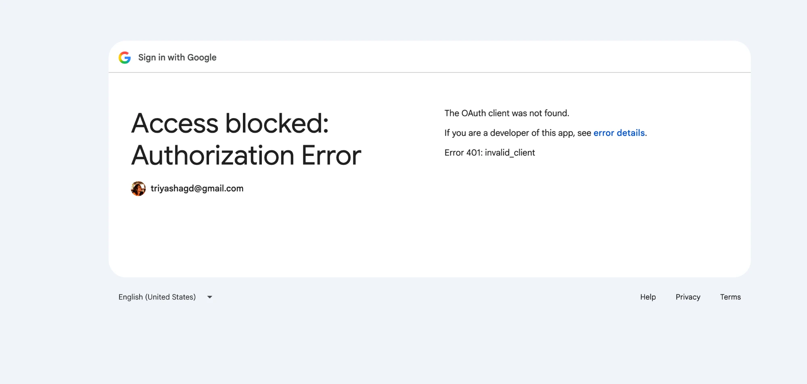

# Prompt logs: how a coding agent was used to build this project

**Tool:** Claude Code in the Claude desktop app (model: Claude Sonnet 5). It used the `frontend-design` skill for the public form, the built-in browser to check the UI against the real backend, and `pytest` for the backend (121 tests at the end).

**Working style:** the human set the stack, the layering rules and every architecture decision. The agent proposed options with tradeoffs, waited for a decision, implemented in small steps, tested, and logged decisions in [Decisions.MD](Decisions.MD). Each step below shows the prompt (copied word for word), what the agent did, and what the human decided or corrected.

**About these excerpts:** they are copied from the chat, so typos are the original ones. Long prompts are shortened where marked with "…". The complete session transcript was exported as a zip to the Downloads folder (`session-export-1789851413746.zip`). It contains email addresses and the full conversation, so it is not committed. Per-prompt notes are in [prompt-logs/](prompt-logs/), and every agent-written commit carries a `Co-Authored-By: Claude Sonnet 5` trailer.

---

## 1. Ground rules first, no code

> Create a CLAUDE.md for this repo.
> You need to abide by this repo structure:
> Stack: FastAPI (backend/), Next.js App Router (frontend/), SQLite via SQLAlchemy.
>
> Rules:
> * layered backend (routers, schemas, services, repositories)
> * no business logic in routers
> * env-driven config
> * no secrets in code
> * small commits
>
> Don't write any app code yet.

**Agent:** wrote `CLAUDE.md` with the layer rules and no app code.
**Human:** renamed the data layer to `data_acceses` in `CLAUDE.md` by hand, and the agent picked that up from the changed file. Later: *"I do not want it to be named repository in data-access it does not make it intuitive. Name it in accordance to data-access naming standards"* → `LeadRepository` became `LeadDataAccess`.

## 2. Design before code, and the agent refusing to guess

> Requirements: [requirement_text]. Propose a system design: components, data model, API list, auth approach, resume storage, email flow, lead state machine, and what changes for production. Give me tradeoffs for each choice. No code yet, I'll review before we proceed.

**Agent:** It produced the full design with tradeoffs and five open decisions.

## 3. The human pushes back and decides

> 1. Do we need our own Auth Service or we can use any other online providers?
> 2. Should we also have an email_events Core Entity so that we do not fire and forget and there are failed email sends incorrectly stating the status.
> 3. Should we use Postgres for this, since we want to make it production grade, since it is also better for handling document storage like resume?

**Agent:** recommended a hosted provider, agreed that `email_events` should be core, and corrected the Postgres premise: resumes should not be stored in the database either way.
**Human:** *"Let us continue with SQLite via SQLAlchemy, use Google SSO."* and *"The user authentication should not be accepted or authenticated as a part of request body"* → became a rule in `CLAUDE.md`, and the schemas forbid extra fields.

## 4. Scaffold, model and data access

> Scaffold the monorepo per the approved design: … Only structure and boilerplate, no feature logic.

> Implement the Lead model (first/last name, email, resume path, state enum PENDING|REACHED_OUT, created_at, reached_out_at), the SQLAlchemy setup, and a LeadRepository. Add the Pydantic schemas. Explain any decision you made that wasn't in the design and log it in DECISIONS.md

**Agent:** built it with tests, and logged what it added beyond the request (UUID id, `reached_out_by`, flush-not-commit).

## 5. Resume storage, with a precise spec

> Implement resume storage per Decisions.MD and CLAUDE.md. Storage layer only: no router, DB model or endpoint.
> - Add a `ResumeStorage` interface in `services/` and a local-disk implementation. …
> - Validate type by magic bytes (pdf/doc/docx), not extension or Content-Type. Reject empty and oversize files.
> - Stored name is a server-generated UUID plus the extension for the detected type. Client filename is never used in a path.
> - Raise domain exceptions, not naive HTTPException.
> - Tests for rejections + one happy path

**Agent:** implemented it (14 new tests). It added its own safeguards: a check that tells `.doc` apart from `.xls`, and only accepting its own key format.
**Human, next prompt:** *"There are too many files in services. are all of them truly belong under services."* The agent audited the folder, admitted the disk I/O did not belong, and recommended a `storage/` package. Human: *"Yes, make the changes as approved."*.

## 6. Email sending: an interruption, then a targeted review

> Add email sending per Decisions.MD and CLAUDE.md. Add `EmailEvent` model and data access first if missing. No router or BackgroundTasks wiring. …

The first run was interrupted before any code was written, so the human said *"Yes, restart the email task"*. The agent built it and listed five points to confirm, one of which admitted it had written the PENDING rows in the wrong place.

> Change #1, #4, and #5.
> Keep #2 as-is.

**Human decision:** #1 (write PENDING rows in the lead's transaction), #4 (use the console fallback locally) and #5 (keep personal data out of default logs) were changed. #2 (keep `EmailService` in `services/`) was kept on purpose. The agent made all three changes without relitigating #2.

## 7. Routers

> Add the leads routers per Decisions.MD and CLAUDE.md. Routers only call services. No SQLAlchemy in routers. … Tests with the test client , negative scenarios and log

**Agent:** built it (79 tests passing). The first attempt at reading form fields returned a 422 in the tests. It found the cause (FastAPI cannot combine a form model with a file upload) and fixed it. It also wired `BackgroundTasks` even though this was not asked, and said so.

## 8. Frontend, using a skill

> Add the public lead form per CLAUDE.md frontend conventions. Public page only; no attorney pages yet.
> use the frontend-design skill and a sage green color

**Agent:** loaded the skill, wrote a design plan, reviewed the plan against the brief before building, and cut two template habits (circled step numbers and a page-load animation). Then it ran the real form in the browser against the real backend.
**Found by looking at the page, not by tests:** the error border was being overridden by the hover style, a rejected file still showed a success check, an old error banner stayed after the problem was fixed, and on mobile the form sat below the fold. All four were fixed.

## 9. Auth, and a question that avoided extra config

> Implement real `get_current_attorney` in `core/auth.py` per Decisions.MD and CLAUDE.md. Backend only. … verify the Google ID token with the `google-auth` library …

> DO you not need all of these, along with authorized list?
> GOOGLE_CLIENT_ID=... GOOGLE_CLIENT_SECRET=... GOOGLE_REDIRECT_URI=http://localhost:8000/auth/google/callback

**Agent:** explained the secret and redirect URI belong to a different sign-in design that the backend does not run, and did not add unused config.
**Human:** *"I will do A, but log in decisions why are are not needing B and log it under prompt7"* to keep the decision trail.

## 10. The attorney side, in two halves

> Add the attorney side per Decisions.MD and CLAUDE.md. Backend download first, then UI. …

**Agent:** noticed the original filename was never stored, so "sanitized original name" needed a new column, and it also found timestamps were coming back without a timezone. Both were fixed, and 121 tests passed. It tested the UI with a fake token server outside the repo, covering 401, 403, 409, sign-out and mobile.
**Human review afterwards:** *"Marking reachout should be asked about in UI, and not just done in one go"* → a confirmation dialog for the one-way action, tested with cancel, Escape, backdrop click and confirm.

## 11. Debugging with a real screenshot

> Why do I get this. I added the information in .env

**Agent:** compared the two env files without printing them. The real client ID was in `backend/.env`, but `frontend/.env.local` still had the placeholder, and the browser sends the frontend's value. It fixed the value and restarted the dev server.

## 12. Real email, and a security review

> Mailhog only sets up a dummy email service. I want to send real emails

**Agent:** proposed Gmail now and a transactional provider for production. It sent one real test email only after the human said the password was in place, and checked the settings first without printing the secret. The decision was logged.

> For 1., do the following:
> Review the whole backend as a skeptical senior engineer. Look specifically for: unauthenticated access to leads or resumes, upload validation gaps, path traversal, blocking calls in async routes, missing transaction handling, and cookie/CORS misconfig. List findings ranked by severity with file and line. Don't fix anything yet.

**Agent:** read all 21 backend files and reported 3 High, 5 Medium and several Low findings. It reproduced four of them with scratch scripts: a 60 MB upload fully received before the 5 MB check, a concurrent `mark_reached_out` where both attorneys got 200, unverified STARTTLS certificates, and the Google certificate fetch running before token decoding. Nothing was fixed, as instructed.

---

## Where the agent was wrong, and how it was caught

| What went wrong | How it was caught | Fix |
|---|---|---|
| Suggested building the lead data layer without checking the repo, when it already existed | The human's own note in `prompt-logs/Prompt4` | Rule: look at the codebase before proposing the next step |
| PENDING email rows written outside the lead's transaction, against the logged design | The agent flagged it; the human asked for the change | Rows written in `create_lead`'s transaction |
| Form model plus file upload returned 422 | Router tests | Individual form fields, validated by the schema |
| Timestamps had no timezone (SQLite drops it) | Reviewing API output before building the UI | UTC validator plus a test |
| Download filename turned `(final)` into `_final_` | A test the agent wrote | Fallback name allows parentheses |
| Error border overridden by hover; success check on a rejected file; stale error banner | Browser screenshots and page-state checks | Specificity fix, rejected-file style, banner cleared |
| Said "five settings" when the email config has six | Re-reading its own logged entry | Corrected in the Decisions log |
| Ran a browser script on the wrong tab (the human's Google page) | Tab check after an unexpected result | Undid the change, then addressed only its own tab |
| Race in `mark_reached_out` (check, then write), and unverified STARTTLS | The security review, reproduced by script | Conditional `UPDATE`, and certificate verification, each with a regression test that fails on the old code |
